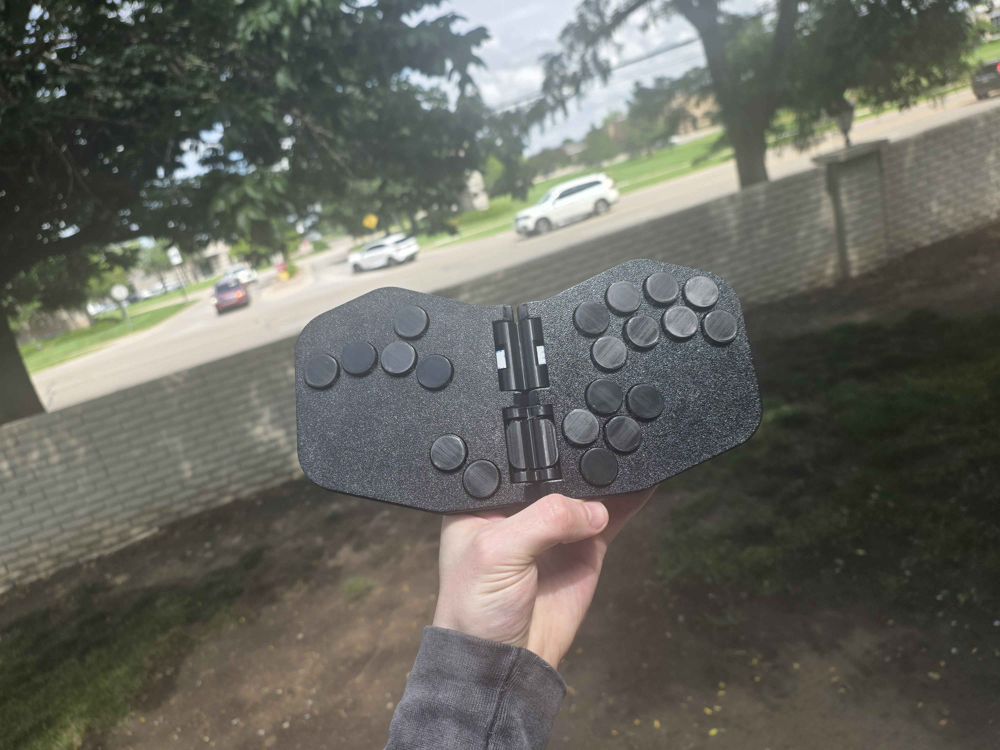

# The Rana Labs Moth (WASD Version)

WASD version of [Rana Labs'](https://github.com/rana-sylvatica) Moth, a foldable leverless controller.

    
    

---

## Components

I printed the entire shell and hinges in **Bambu Lab Matte PLA** (any PLA should work, though build quality feel may vary).

- **Mainboard:** RP2040 integrated directly onto the left custom PCB. The right side connects via ribbon cable.
- **Switches:** Any Kailh Choc low-profile switch. Must be low-profile — standard height switches won't fit.
- **USB-C:** [QuRB](https://github.com/rana-sylvatica/rana-tadpole/tree/main/PCBs/Breakout%20Board%20(QuRB)) by [Quark Works](https://github.com/quark-works) and Rana Labs — a USB-C breakout board with a ribbon cable port for solderless assembly.
- **Hardware:** M2 and M3 screws only. You'll need ten M3 heat inserts for the backplates, twelve M3×5/6mm bolts for the backplates and QuRB, and eight M2×4mm bolts for the mainboards.

---

## Assembly

The custom PCB eliminates all handwiring — the only soldering required is installing the hotswap sockets for the Choc switches.

The two halves connect via a 20-pin 0.5mm pitch ribbon cable. The QuRB connects to the left board via a 12-pin 0.5mm pitch ribbon cable for the USB-C port.

---

## Magnets

Strong magnets are essential — they're working against the spring force of every switch.

- **Size:** 6×3mm Neodymium, stacked 2 high per hole
- **Count:** 10 holes × 2 magnets = **20 magnets total**

The snap when closing is very satisfying and holds the Moth securely folded.

→ [Amazon link to magnets used](https://www.amazon.com/dp/B096LZNZTQ)

---

## Prism Ergonomic Mode

In the reverse-folded position, a lip on each hinge piece stops the wings from overfolding and creates a clean resting angle. The rounded hinge backs add friction to keep the Moth rigid in this position.

You can edit the lip width in the hinge model to adjust the fold angle to your preference.

---

## Notes

- **Button fit:** Buttons must sit flush with the face when depressed, or the halves won't close cleanly. Strong magnets may compensate for minor protrusion.
- **Hinge pin slot:** Left open in this design — the friction fit holds without caps, and it makes intentional pin removal much easier.

---

## Files

| Folder | Contents |
|--------|----------|
| `Shell/` | Top panels and backplates (STEP) |
| `Hinge and Buttons/` | Hinge upper/lower, hinge pin, and keycap models (STEP) |
| `Moth PCB/` | KiCad PCB project, schematics, and fabrication files |
| `DXF/` | PCB outlines and hole patterns |
| `Images/` | Build photos |
